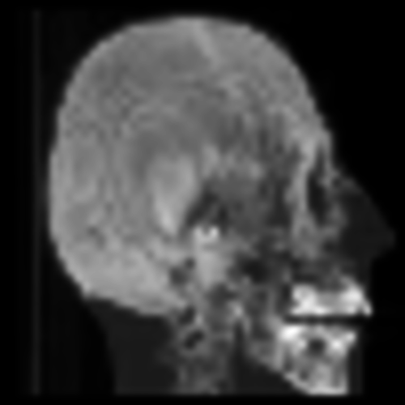
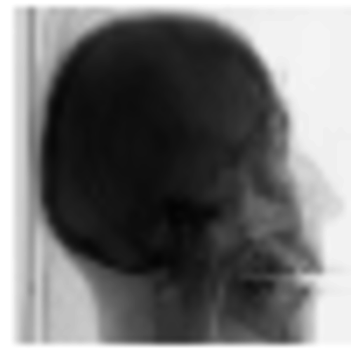

##*Volume Rendering*

-----
**CMake Build instructions**

-----
  - Out-of-source build :
 ```
git clone git@github.com:Modelisation5ETI/TP7_VolumeRendering.git && \
mkdir TP7_VolumeRendering-build && cd TP7_VolumeRendering-build  && \
cmake ../TP7_VolumeRendering  && \
make -j
 
 ```
  - QtCreator :
 ```
git clone git@github.com:Modelisation5ETI/TP7_VolumeRendering.git  && \
mkdir TP7_VolumeRendering-build && cd TP7_VolumeRendering-build  && \
qtcreator ../TP7_VolumeRendering
 
 ```
  *Then configure project using QtCreator API* : 
   - *Set the build directory to TP7_VolumeRendering-build/*
   - *Run CMake and build project*


-----
**Implementation**

-----
Generate output using :
 ```
 ./VolumeRendering
 python ./generate_animation.py 
 bash script_plot.sh
 ```
 
 
 

 
The current implementation generates multiple slices from the input volume 
and save them in the *output/* directory of the build directory. 

A few scripts are provided to visualize data :
 - generate_animation.py : Generate a .gif animation from the slices and
 store it in output_anim.
 - script_plot.sh : plot the emission and attenuation transfert function

